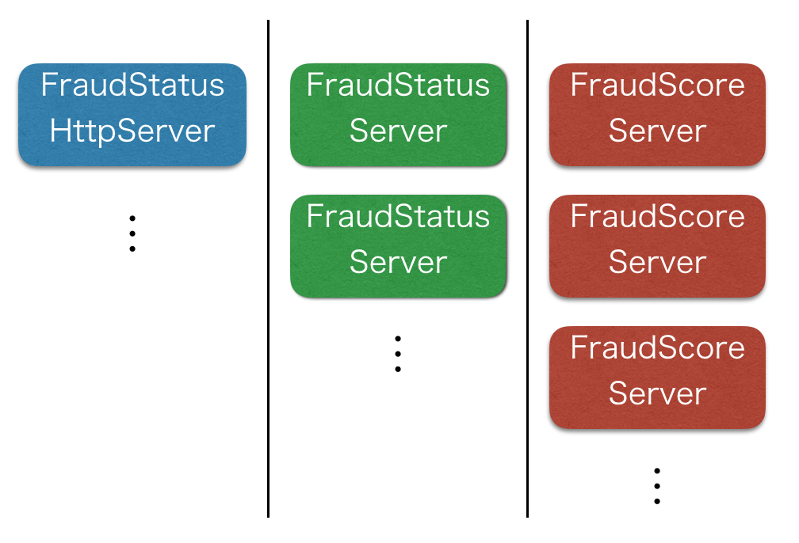
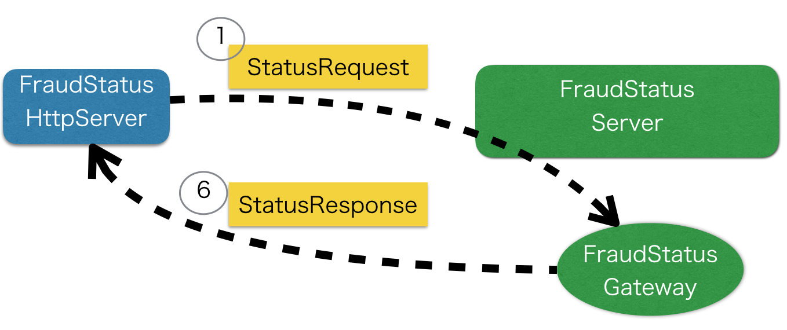
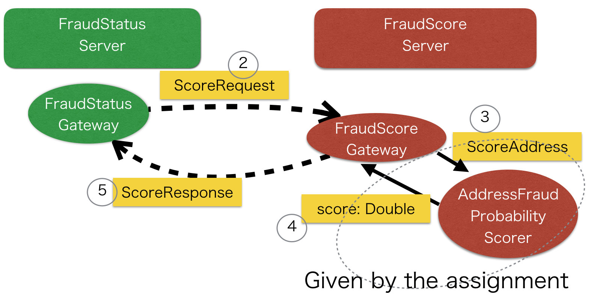
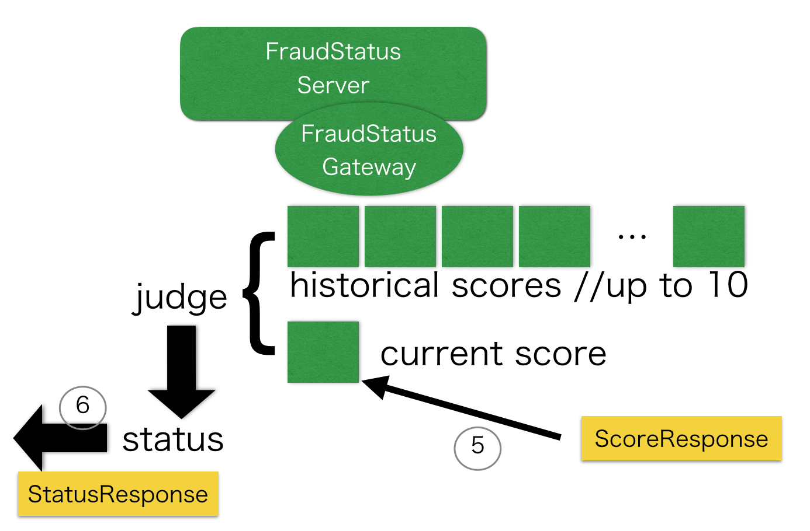
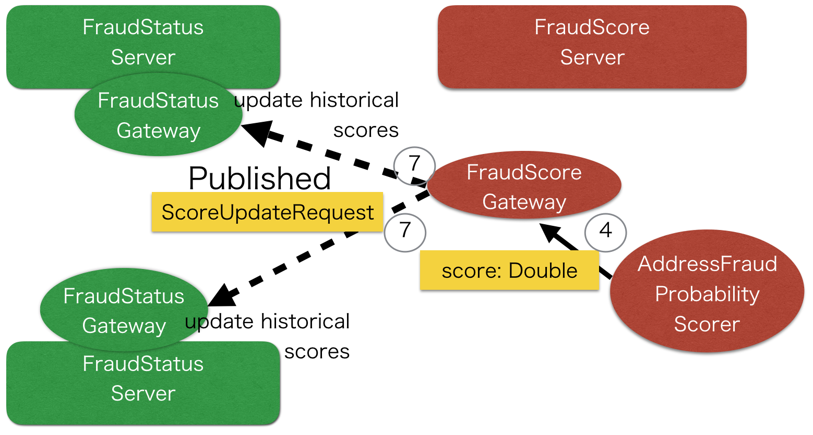

## Overview


The entire application consists of three separate servers, 

* FraudStatusHttpServer
* FraudStatusServer
* FraudScoreServer

So far the application only runs on a local machine, as far as I tested on my MacBook.

The original plan was to run this in Google Container Engine with Kubernetes but I wasn't able to get there yet...

## HOW TO RUN

### FraudScoreServer 

As in `src/main/resources/application.conf`, the Akka Cluster seed nodes are hardcoded as follows:

``` 
cluster {
  seed-nodes = [
    "akka.tcp://FraudCheckerCluster@127.0.0.1:2551",
    "akka.tcp://FraudCheckerCluster@127.0.0.1:2552"
  ]
}
```

So we pass the port number 2551, and 2552 ot FraudScoreServer to run them as the seed nodes.

Firstly launch FraudScoreServer from terminal with port 2551,

```
$ sbt 
> ...
> runMain com.paidy.server.FraudScoreServer 2551
```

and in a different terminal tab,

```
$ sbt
> ...
> runMain com.paidy.server.FraudScoreServer 2552
```

If it is successful so far, you will see log messages like below.

```
[INFO] [04/10/2017 23:15:20.673] [FraudCheckerCluster-akka.actor.default-dispatcher-3] [akka.cluster.Cluster(akka://FraudCheckerCluster)] Cluster Node [akka.tcp://FraudCheckerCluster@127.0.0.1:2551] - Leader is moving node [akka.tcp://FraudCheckerCluster@127.0.0.1:2551] to [Up]
[INFO] [04/10/2017 23:15:25.625] [FraudCheckerCluster-akka.actor.default-dispatcher-4] [akka.cluster.Cluster(akka://FraudCheckerCluster)] Cluster Node [akka.tcp://FraudCheckerCluster@127.0.0.1:2551] - Node [akka.tcp://FraudCheckerCluster@127.0.0.1:2552] is JOINING, roles []
```


### FraudStatusServer 

Launch FraudStatusServer as follows,

```
$ sbt
> ...
> runMain com.paidy.server.FraudStatusServer 2553
```

and in a different terminal, you can start up another instance:

```
$ sbt 
> ...
> runMain com.paidy.server.FraudStatusServer 2554
```

You don't need to specify a port number as it will be a non-seed node in Akka Cluster.
However, a fixed port number makes things easy in case you restart the process. Otherwise,
you would need to manually remove the stopped `IP:Port` from the cluster.

### FraudStatusHttpServer 

Finally you can bring up an HTTP server instance.

```
$ sbt 
> ...
> runMain com.paidy.server.FraudStatusHttpServer 2555
```

and see a message like below:

```
Server online at http://localhost:8080
```

### Confirm the cluster is composed correctly

At this point, if you check the log of the process with port = 2551, you will see like below:

```
[INFO] [04/10/2017 23:15:20.661] [FraudCheckerCluster-akka.actor.default-dispatcher-3] [akka.cluster.Cluster(akka://FraudCheckerCluster)] Cluster Node [akka.tcp://FraudCheckerCluster@127.0.0.1:2551] - Node [akka.tcp://FraudCheckerCluster@127.0.0.1:2551] is JOINING, roles []
[INFO] [04/10/2017 23:15:20.673] [FraudCheckerCluster-akka.actor.default-dispatcher-3] [akka.cluster.Cluster(akka://FraudCheckerCluster)] Cluster Node [akka.tcp://FraudCheckerCluster@127.0.0.1:2551] - Leader is moving node [akka.tcp://FraudCheckerCluster@127.0.0.1:2551] to [Up]
[INFO] [04/10/2017 23:15:25.625] [FraudCheckerCluster-akka.actor.default-dispatcher-4] [akka.cluster.Cluster(akka://FraudCheckerCluster)] Cluster Node [akka.tcp://FraudCheckerCluster@127.0.0.1:2551] - Node [akka.tcp://FraudCheckerCluster@127.0.0.1:2552] is JOINING, roles []
[INFO] [04/10/2017 23:15:26.621] [FraudCheckerCluster-akka.actor.default-dispatcher-15] [akka.cluster.Cluster(akka://FraudCheckerCluster)] Cluster Node [akka.tcp://FraudCheckerCluster@127.0.0.1:2551] - Leader is moving node [akka.tcp://FraudCheckerCluster@127.0.0.1:2552] to [Up]
[INFO] [04/10/2017 23:15:40.329] [FraudCheckerCluster-akka.actor.default-dispatcher-18] [akka.cluster.Cluster(akka://FraudCheckerCluster)] Cluster Node [akka.tcp://FraudCheckerCluster@127.0.0.1:2551] - Node [akka.tcp://FraudCheckerCluster@127.0.0.1:2553] is JOINING, roles []
[INFO] [04/10/2017 23:15:40.618] [FraudCheckerCluster-akka.actor.default-dispatcher-20] [akka.cluster.Cluster(akka://FraudCheckerCluster)] Cluster Node [akka.tcp://FraudCheckerCluster@127.0.0.1:2551] - Leader is moving node [akka.tcp://FraudCheckerCluster@127.0.0.1:2553] to [Up]
[INFO] [04/10/2017 23:15:44.281] [FraudCheckerCluster-akka.actor.default-dispatcher-2] [akka.cluster.Cluster(akka://FraudCheckerCluster)] Cluster Node [akka.tcp://FraudCheckerCluster@127.0.0.1:2551] - Node [akka.tcp://FraudCheckerCluster@127.0.0.1:2554] is JOINING, roles []
[INFO] [04/10/2017 23:15:45.619] [FraudCheckerCluster-akka.actor.default-dispatcher-4] [akka.cluster.Cluster(akka://FraudCheckerCluster)] Cluster Node [akka.tcp://FraudCheckerCluster@127.0.0.1:2551] - Leader is moving node [akka.tcp://FraudCheckerCluster@127.0.0.1:2554] to [Up]
[INFO] [04/10/2017 23:16:26.013] [FraudCheckerCluster-akka.actor.default-dispatcher-19] [akka.cluster.Cluster(akka://FraudCheckerCluster)] Cluster Node [akka.tcp://FraudCheckerCluster@127.0.0.1:2551] - Node [akka.tcp://FraudCheckerCluster@127.0.0.1:2555] is JOINING, roles []
[INFO] [04/10/2017 23:16:27.620] [FraudCheckerCluster-akka.actor.default-dispatcher-3] [akka.cluster.Cluster(akka://FraudCheckerCluster)] Cluster Node [akka.tcp://FraudCheckerCluster@127.0.0.1:2551] - Leader is moving node [akka.tcp://FraudCheckerCluster@127.0.0.1:2555] to [Up]
```

where all the nodes are in `[Up]` status. Also in the log of other terminals, you will see like below:

```
[INFO] [04/10/2017 23:15:25.808] [FraudCheckerCluster-akka.actor.default-dispatcher-20] [akka.cluster.Cluster(akka://FraudCheckerCluster)] Cluster Node [akka.tcp://FraudCheckerCluster@127.0.0.1:2552] - Welcome from [akka.tcp://FraudCheckerCluster@127.0.0.1:2551]
```

If you didn't see these log messages, the cluster is not composed correctly.

### Curl to send a JSON request

curl command like below sends a JSON request, which represents an `Address` of a requester, to the HTTP server.

```
$ curl -H 'Content-Type:application/json' -d '{"city":"Tokyo","line1":"Minato-ku","line2":"Roppongi","state":"","zip":"106-0032" }' http://localhost:8080/check
```

then it will either receive a response in JSON, which includes the fraud-check status, and the address which was sent to the server:  

```
{"status":false,"address":{"city":"Tokyo","zip":"106-0032","state":"","line1":"Minato-ku","line2":"Roppongi"}}
```

if there the request times out, you will see an error like below which represents an HTTP 500 error.

```
There was an internal server error.
```

## DESIGN


### Scalability 



The reason for having the three separate servers is to allow you scale each of them individually.
(Originally I was trying to use Kubernetes and increase replicas of each server in deployment... )

### Step 1



When `FraudStatusHttpServer` receives a request, 

* 1: It converts the message into `StatusRequest` and send it to `FraudStatusGateway`
  * 1.1: The destination `FraudStatusGateway` actor is chosen by [Akka's distributed pub sub send](http://doc.akka.io/docs/akka/2.4.17/scala/distributed-pub-sub.html#Send),
  so that requests are load-balanced
  
* 6: Finally `FraudStatusHttpServer` receives `StatusResponse` from  `FraudStatusGateway`

### Step 2



* 2: Then `ScoreRequest` is sent to a `FraudScoreGateway` actor 
  * 2.2: Like 1.1: it uses [Akka's distributed pub sub send](http://doc.akka.io/docs/akka/2.4.17/scala/distributed-pub-sub.html#Send)
* 3: `FraudScoreGateway` passes `ScoreAddress` to an `AddressFraudProbabilityScorer` actor
* 4: `AddressFraudProbabilityScorer` sends back a `Double`, which represents a score  
* 5: `FraudScoreGateway` actor sends `ScoreResponse` to `FraudStatusGateway`

### Step 3



* 6: `FraudScoreGateway` judges the status from the current score returned by 5: 
and the historical scores up to last 10, then sends back a `StatusResponse` to the HTTP server

`FraudScoreGateway` internally holds a key-value map (`scala.collection.immutable.Map`) to keep track of
historical scores for different addresses. Each address has a unique key in the map.

### Step 4



* 7: Right after `FraudScoreGateway` receives `ScoreResponse` as in 4, it actually publishes 'ScoreUpdateRequest' to 
`FraudStatusGateway` actors too, so that 'EVERY' `FraudStatusGateway` actor updates historical scores with the latest score

### Caveats

I didn't have time to implement solutions to these:

* For 4 ~ 5: also, if a message is lost, then `FraudStatusGateway` actors could miss historical scores, or inconsistent history across the actors
  * Akka Distributed Pub/Sub has delivery guarantee as [at most once](http://doc.akka.io/docs/akka/2.4.17/scala/distributed-pub-sub.html#Delivery_Guarantee),
  which means messages can be lost
  * As in the linked doc Kafka might be help ... I'm not very familiar with it to be honest

* For 6: Currently `FraudStatusServer` / `FraudStatusGateway` doesn't have resiliency, 
which means if one of the servers/actors goes down, and restarted, the restarted one has no history
  * This could be avoided by persistence like a SQL store
  * Maybe putting a PersistentActor in the middle would work well
  
