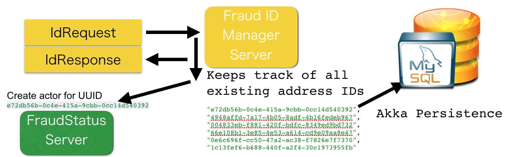
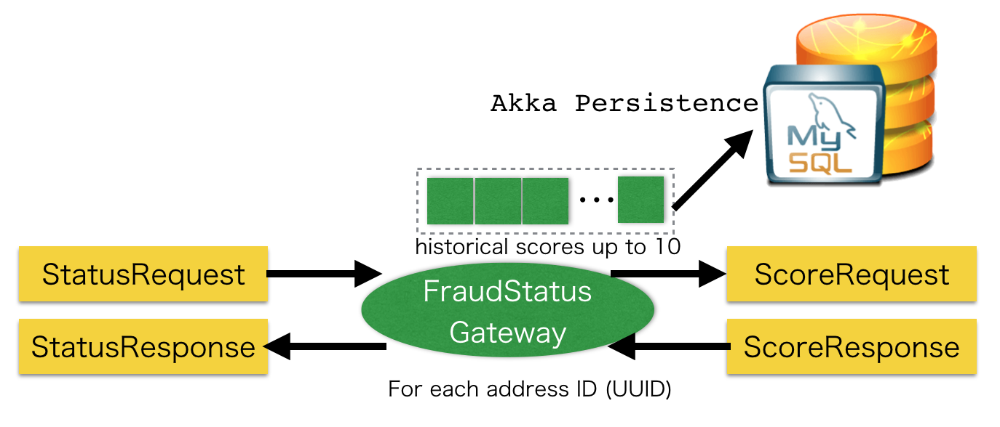

## Overview

The application is running in Kubernetes at [http://35.187.209.185](http://35.187.209.185/address-id)

The entire application consists of four separate servers, 

* FraudStatusHttpServer
* FraudStatusServer
* FraudScoreServer
* FraudIdManagerServer

## HOW TO RUN

### Run a fraud check for a new address 

#### 1. To use utility shell scripts, please git clone this repository

`git clone git@github.com:richard-imaoka/assignment.git`

#### 2. Run the following to get an address ID (UUID)

`curl -X POST http://35.187.209.185/address-id`

You will get an address ID like below

`3297bcfc-da93-4a74-9a84-bc7a0cef0c2b`


#### 3. Create address JSON with the address ID obtained in 2.

You need the [`jo`](https://github.com/jpmens/jo) command installed (brew install jo) to run the following:

`./address-json.sh 3297bcfc-da93-4a74-9a84-bc7a0cef0c2b`

resulting JSON.

```
{
   "addressID": "3297bcfc-da93-4a74-9a84-bc7a0cef0c2b",
   "city": "Tokyo",
   "line1": "Minato-Ku",
   "line2": "Roppongi",
   "state": "Tokyo",
   "zip": "106-0032"
}
```

#### 4. Send the address JSON from 3. to the fraud check http server

`./address-json.sh 3297bcfc-da93-4a74-9a84-bc7a0cef0c2b | curl -H 'Content-Type:application/json' http://35.187.209.185/check -X POST -d @-`


#### 5. You get a response JSON with fraud check status, if not timed out 

`{"status":true,"address":{"city":"Tokyo","zip":"106-0032","state":"Tokyo","line1":"Minato-Ku","line2":"Roppongi","addressID":"3297bcfc-da93-4a74-9a84-bc7a0cef0c2b"}}`

### More actions

#### 6. Access to the following from your browser, to see all existing address IDs 

http://35.187.209.185/address-id

#### 7. Pick any of address ID from 6. and substitute it in the following URL, to check historical fraud check scores for the address ID

(e.g.) http://35.187.209.185/address-scores/3297bcfc-da93-4a74-9a84-bc7a0cef0c2b

## DESIGN

### Uniqueness of address by address ID 

* I introduced address ID, which is to distinguish an address from another 
  * This was not in assignment's specification
  * However, an ID to uniquely identify an address would be a practical assumption

### Scalability 


The reason for having the separate servers is to allow you scaling each of them individually.
All these servers can communicate to each other using [Akka Cluster](http://doc.akka.io/docs/akka/2.5/scala/cluster-usage.html).

### FraudStatusHttpServer


Here are URLs used in the HTTP server:

* /check
  * POST: perform fraud status check for the given address

For debugging purposes, these paths are also available, although for the service design perspective, these don't need to be exposed.

* /address-id
  * POST: create a new address ID
  * GET: get all existing address IDs
* /address-scores:{address-id-UUID-string}
  * GET: get historical fraud check scores for the address ID

`FraudStatusHttpServer` is written in [Akka HTTP](http://doc.akka.io/docs/akka-http/current/scala.html)

### FraudIdManagerServer

This server keeps track of all existing address IDs (UUID)



* Upon receiving a new `IdRequest`, 
  * it generates a new address ID
  * then asks `FraudStatusServer` to create a new `FraudStatusGateway` actor for the new address ID
* It uses [PersistentActor](http://doc.akka.io/docs/akka/2.5/scala/persistence.html) so that it remembers address IDs even when it is down

### FraudStatusServer


* `FraudStatusServer` holds multiple `FraudStatusGateway` actors
* Each `FraudStatusGateway` actor is for one address ID
* [Akka's distributed pub sub send](http://doc.akka.io/docs/akka/2.4.17/scala/distributed-pub-sub.html#Send) is used to locate each actor



* When `FraudStatusGateway` receives a `StatusRequest`, it eventually returns `StatusResponse` with either `true` or `false` status of fraud-check 
  * `FraudStatusGateway` asks `FraudScoreServer` for a new fraud score
  * If the score is < 0.78, the fraud-check status is `true`, otherwise `false`
  * When there are 10 historical fraud-check scores in the past (stored in `FraudStatusGateway`) **AND** their average > 0.7 `FraudStatusGateway` returns early with the status = `false`
* Historical scores are kept in-memory of the actor, and also persisted with Akka Persistence  
  
### FraudScoreServer


`FraudScoreServer` holds `AddressFraudProbabilityScorer` and it sends back a score upon request.

### Health Checking

Sometimes, the entire system (including FraudIdManagerServer) goes down and comes back. 
Otherwise, one instance of `FraudStatusServer` might go down and all its associated `FraudStatusGateway` actors could be gone.

To make the system work in such situations, the system has health-checking capabilities, 
and currently it resides in `FraudIdManager` as it keeps track of all address IDs.

`FraudIdManagerServer` holds a health-checker actor for each address ID, and it keeps pinging corresponding `FraudStausGateway` actor periodically for the address ID.

When the health-checker fails to receive a heartbeat from the `FraudStatusGateway` actor, it asks `FraudStatusServer` to 
create a new `FraudStatusGateway` actor for the address ID.

### Caveats

* `FraudIdManager` became a single point of failure ... 
* Currently using MySQL for Akka Persistence storage, but better to use more distributed stores like Cassandra for performance
